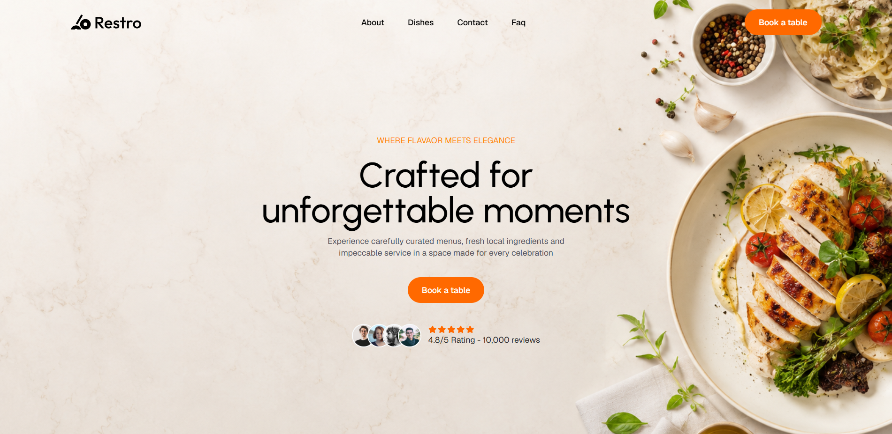

# 🍽️ Dishly — Restaurant Landing Page

A modern, fully responsive restaurant landing page built with **React 19**, **Vite**, **Tailwind CSS v4**, and **Framer Motion (Motion v13)**. Features smooth scroll animations, interactive sections, and a clean elegant UI designed for a premium dining experience.

## 🌐 Live Demo

> **[View Live →](https://dishly-one.vercel.app/)**


---

## 📸 Preview



---

## ✨ Features

- ⚡ Built with **React 19 + Vite 8** for blazing fast performance
- 🎨 Styled with **Tailwind CSS v4** — utility-first, responsive design
- 🎞️ Smooth entrance animations powered by **Motion (Framer Motion v13)**
- 🖱️ Butter-smooth scrolling via **Lenis**
- 🍕 Interactive **Dishes** section with animated plate cards
- 📋 **FAQ** accordion section
- 🕐 **Restaurant Timing** table
- 💬 **Testimonials** slider/section
- 📅 **Booking Process** step-by-step guide
- 🌟 **Features** and **Stats** highlight sections
- 📞 **CTA** (Call-to-Action) and **Footer** with social links
- 📱 Fully responsive across mobile, tablet, and desktop

---

## 🛠️ Tech Stack

| Technology | Version | Purpose |
|---|---|---|
| [React](https://react.dev/) | ^19.2.8 | UI Library |
| [Vite](https://vite.dev/) | ^8.2.2 | Build Tool |
| [Tailwind CSS](https://tailwindcss.com/) | ^4.3.3 | Styling |
| [Motion](https://motion.dev/) | ^13.2.0 | Animations |
| [Lenis](https://lenis.darkroom.engineering/) | ^1.3.26 | Smooth Scroll |
| [Lucide React](https://lucide.dev/) | ^1.43.0 | Icons |

---

## 📁 Project Structure

```
Dishly/
├── public/
│   └── assets/          # Static images (dishes, hero, users, logo)
├── src/
│   ├── components/
│   │   ├── Animated.jsx      # Reusable scroll-reveal animation wrapper
│   │   ├── Footer.jsx        # Site footer with links & socials
│   │   ├── LenisScroll.jsx   # Smooth scroll provider
│   │   └── Navbar.jsx        # Navigation bar
│   ├── data/
│   │   └── data.jsx          # All static data (dishes, FAQs, testimonials, etc.)
│   ├── sections/
│   │   ├── HeroSection.jsx
│   │   ├── About.jsx
│   │   ├── Stats.jsx
│   │   ├── Dishes.jsx
│   │   ├── Features.jsx
│   │   ├── BookingProcess.jsx
│   │   ├── Timing.jsx
│   │   ├── TestimonialSection.jsx
│   │   ├── FAQs.jsx
│   │   └── CTA.jsx
│   ├── App.jsx
│   ├── main.jsx
│   └── index.css
├── index.html
├── vite.config.js
└── package.json
```

---

## 🚀 Getting Started

### Prerequisites

Make sure you have **Node.js** (v18 or higher) installed.

### Installation

1. **Clone the repository**
   ```bash
   git clone https://github.com/your-username/dishly.git
   cd dishly
   ```

2. **Install dependencies**
   ```bash
   npm install
   ```

3. **Start the development server**
   ```bash
   npm run dev
   ```

4. **Open in browser**
   ```
   http://localhost:5173
   ```

### Build for Production

```bash
npm run build
```

The output will be in the `dist/` folder, ready to deploy.

---

## 📦 Deployment

See the **Deployment Guide** section below for step-by-step instructions on deploying to **Vercel** or **GitHub Pages**.

---

## 📄 License

This project is open source and available under the [MIT License](LICENSE).

---

## 🙋‍♂️ Author

**Muhammad Haris Khan**
- GitHub: [@your-github-username](https://github.com/your-github-username)
- LinkedIn: [your-linkedin](https://linkedin.com/in/your-linkedin)